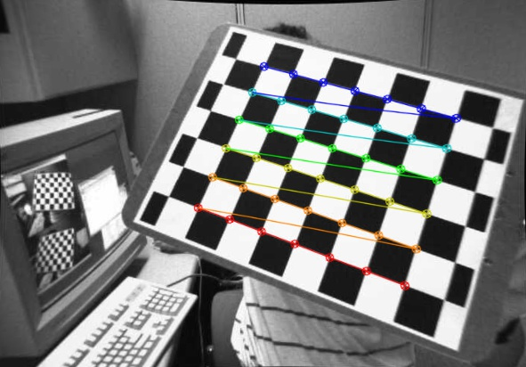

# stereo
About project Stereo

## Calibration.py

​	此文件完成了6、7小题，实现了相机校准，和图像校正两个功能。只需将整个stereo完整下载，运行`calibration.py`，即可看到校准后的图片，按`esc`键退出此张图片，进入下一张图片校正，直至14张图片完成后，退出此程序。

​	结果事例（随机挑选了一个，其余的可通过运行程序查看）：

校正前的图像：

方法一校正后的图像：

方法二校正后的图像：

> 注：存在一些图片无法校正，其图片的大小为0

# Modify 

1. 2019/05/03	第一次上传，完成了相机校准和图像校正
2. 2019/05/04    修复了生成图像和原图像命名不同（由于glob.glob()返回的序列不是根据命名字母顺序）