# stereo
About project Stereo

***Instructions:***

Simply download the entire `stereo` completely, and you need:

* Python 3.6
* Opencv 4.0

## Calibration.py

This document completes the 6,7 sub-question, implements two functions of camera calibration and image correction. 

***Instructions:***

Run `calibration.py`, you can see the calibrated picture in `output/calibration/`. 

***Results***

The result case (one randomly selected, the rest can be viewed by running the program):

**Image before correction:**

**Draw the chessboard:**

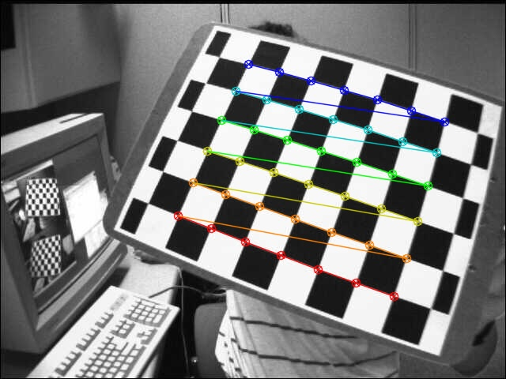

**Image after correction:**

*Method 1:*

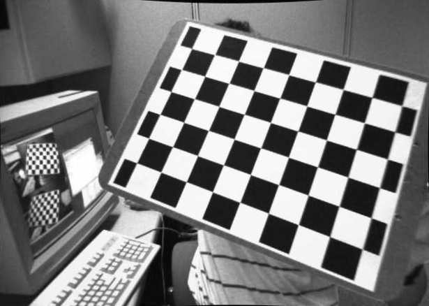

*Method 2:*

> Note: Some pictures cannot be corrected, and the size of the picture is 0.

## epilines.py

After learning the Epipolar geometry, this document implements the functions of finding the corresponding points, calculating the fundamental matrix, calculating the epipolar line and marking them according to the official OpenCV document. 

And tried two methods provided in OpenCV: brute force and FLANN.

> And we use this to test whether camera rectificationis is good or not

***Instructions:***

Run `calibration.py`, you can see the calibrated picture in `output/epilines/`. 

***Results***

*One of the left image:*

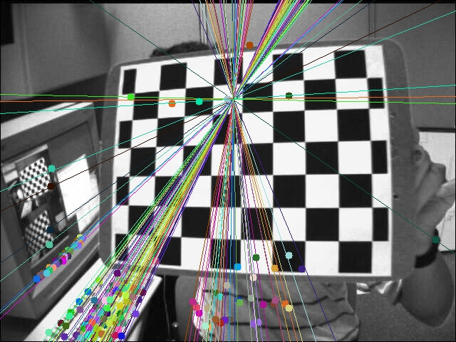

*Corresponding the right image:*

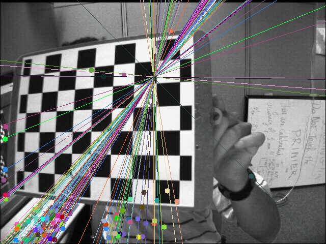

*Corresponding the matches image:*

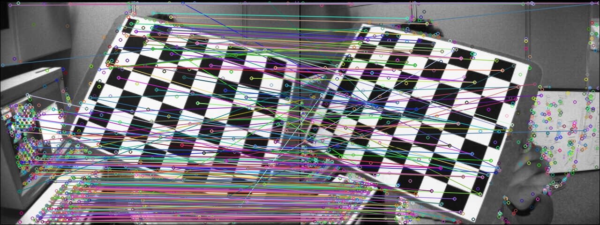

However, there are some errors in the corresponding points, and some corresponding points are not on the board. The corresponding point relationship of the keyboard is correct, probably because the location is similar, but it is not the object we want to study.

## calibrate_binocular.py

This document is used to implement **Stereo calibration and rectification**. 

***Instructions:***

Run `calibration.py`, you can see the calibrated and rectified picture in `output/calibration/`. 

***Results***

（The figure below is the same source file analysis as the corresponding point analysis chart before correction.）

*The left original picture:*

*The right original image:*

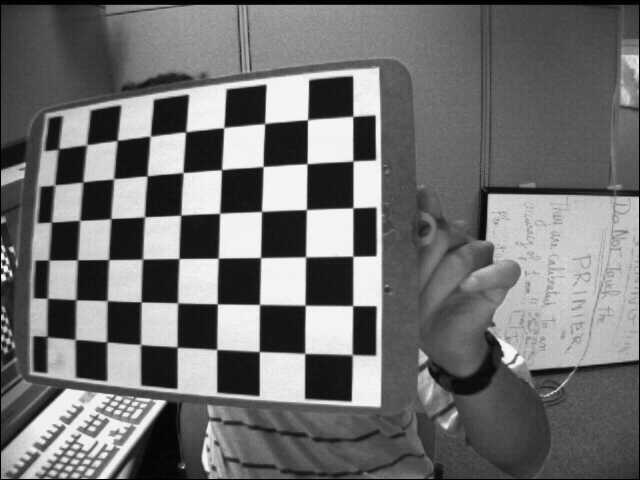

*calibration and rectification:*

(Obviously, it succeed.)

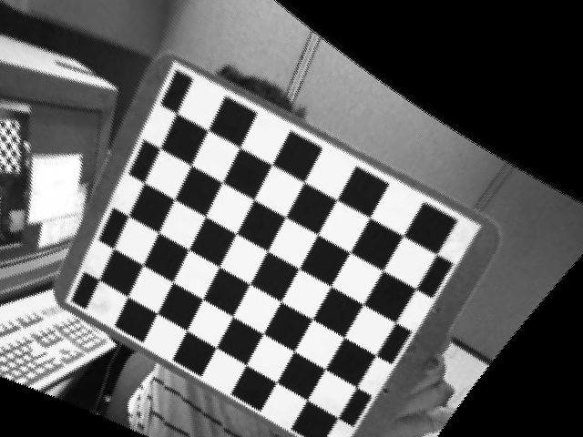

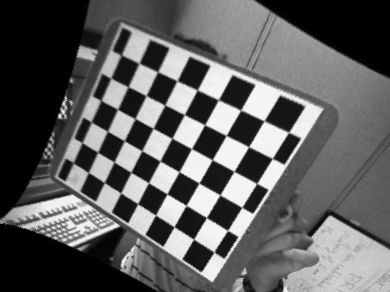

Some values about the parameters are as follows：

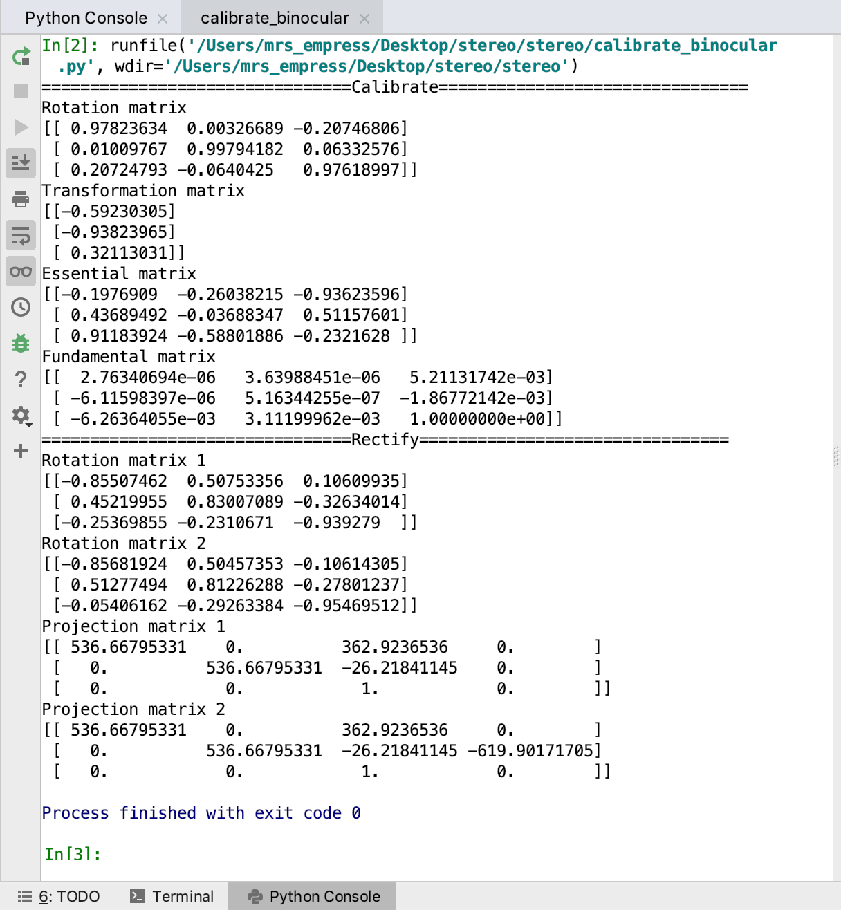

After stereo correction, perform corresponding point analysis:

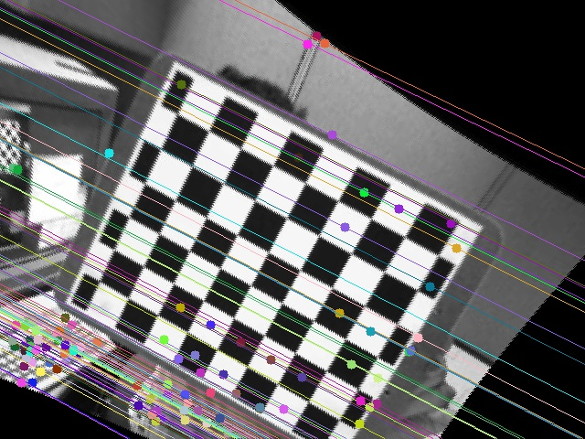

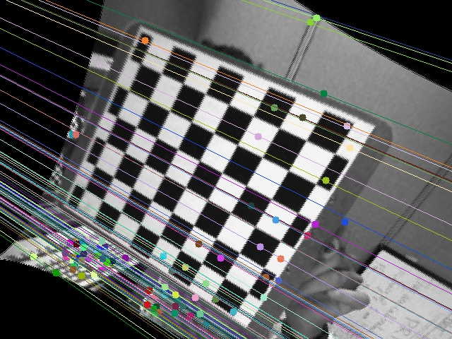

We can find that the epipolar lines are parallel and the corresponding pixels are the same position in the two figures. It may prove that the rectification is successful.

## Disparity

In this module, I use OpenCV to compute the disparity maps for the images I used for stereo calibration. And the result as follows.

### Disparity_BM.py

Block matching method:

*The left image:*

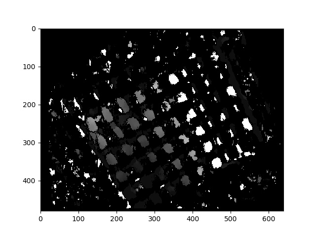

*The right image:*

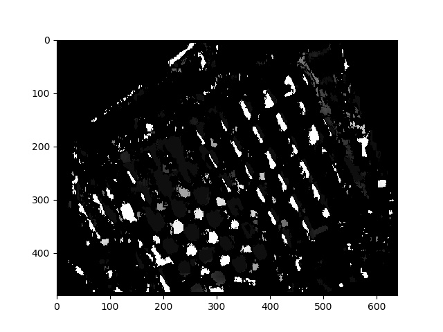

### Disparity_DP.py

Dynamic programming method:

*The left image:*

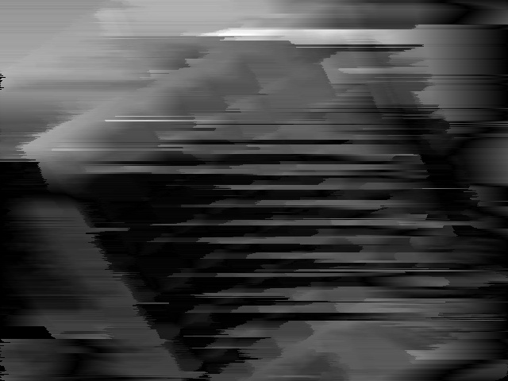

*The right image:*

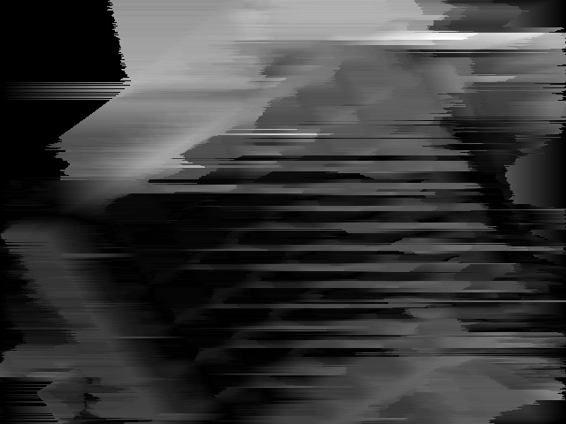

### Disparity_SGBM.py

Semi-global block matching method:

*The left image:*

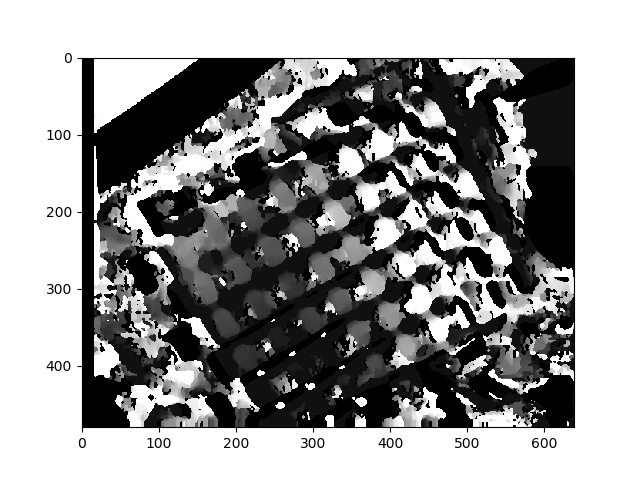

*The right image:*

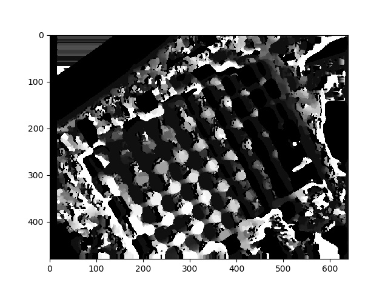

当增加SGBM中的blocksize值后，可以减少一些噪声，但是也会去除一些有用的信息：

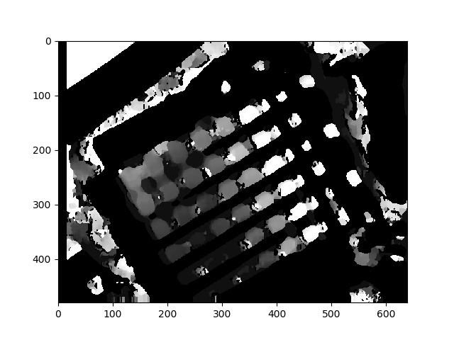

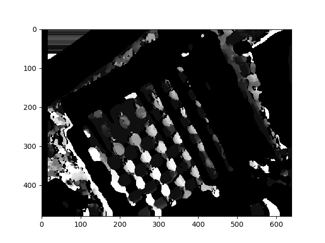

# Modify 

1. 2019/05/03	First upload, completed camera calibration and image correction 
2. 2019/05/04	Fixed the difference between the generated image and the original image (because the sequence returned by `glob.glob()` is not based on the named alphabetical order)
3. 2019/05/09	Add `epilines.py`
4. 2019/05/10	Add `calibrate_binocular.py`
5. 2019/05/11	Modify `calibrate_binocular.py`, add  *rectification* function
6. 2019/05/12	Add `calibrate_binocular.m`, which is from [Tutorial on Rectification of Stereo Images]([http://homepages.inf.ed.ac.uk/rbf/CVonline/LOCAL_COPIES/FUSIELLO/node18.html](http://homepages.inf.ed.ac.uk/rbf/CVonline/LOCAL_COPIES/FUSIELLO/node18.html))
7. 2019/05/14	Add `Disparity_BM.py`, `Disparity_DP.py`, `Disparity_SGBM.py`
8. 2019/05/15	Add timing function
9. 2019/05/17	Temporarily stop project update

