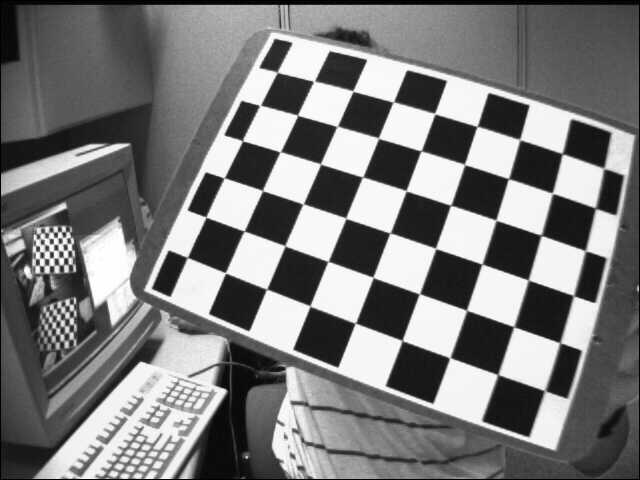

# stereo
About project Stereo

## Calibration.py

This document completes the 6,7 sub-question, implements two functions of camera calibration and image correction. 

***Instructions:***

Simply download the entire `stereo` completely, run `calibration.py`, you can see the calibrated picture. Press ESC to exit the picture, and then go to the next picture correction. Exit the program after 14 pictures are completed.

***Results***

The result case (one randomly selected, the rest can be viewed by running the program):

**Image before correction:**

**Image after correction:**

*Method 1:*

*Method 2:*

> Note: Some pictures cannot be corrected, and the size of the picture is 0.

# Modify 

1. 2019/05/03	First upload, completed camera calibration and image correction 
2. 2019/05/04    Fixed the difference between the generated image and the original image (because the sequence returned by `glob.glob()` is not based on the named alphabetical order)

